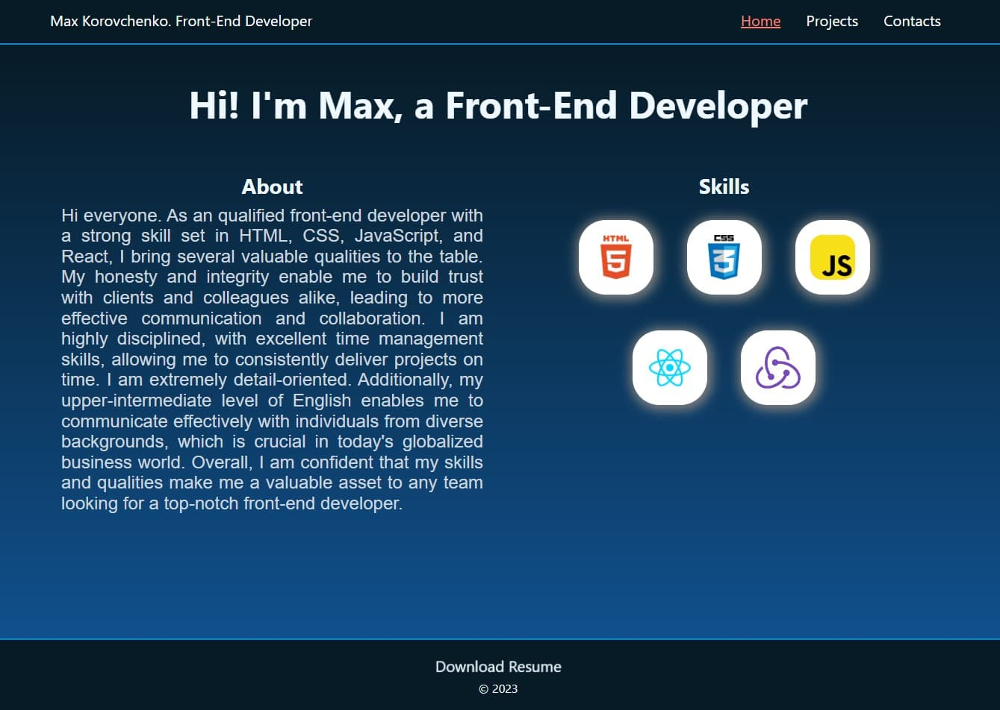
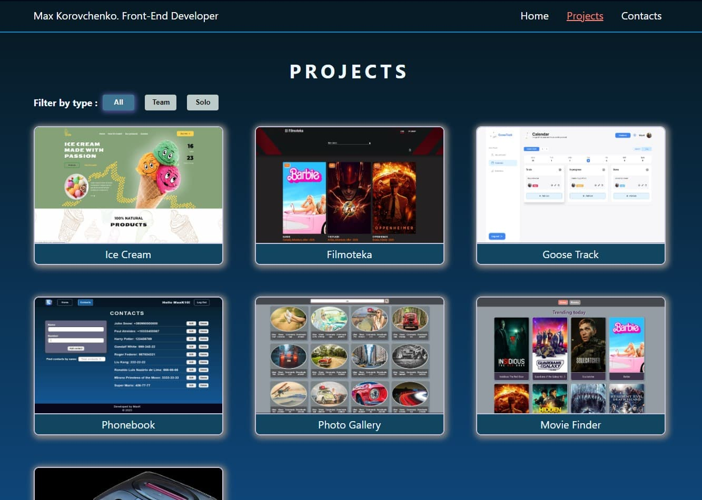

# My Portfolio App

Welcome to My Portfolio, a React.js application designed to showcase my skills,
projects, and provide a brief overview of who I am.

## Screenshots

#### Home Page

#### Projects Page

## Features

- **Pages**:

  - Home: Displays information about me and my skills. Provides a welcoming
    introduction to visitors.
  - Projects: Features a collection of projects I have worked on. Includes a
    filter menu for sorting projects by type (all, team, solo).
  - ProjectDetails: Offers detailed information about a specific project.
    Includes a short description of the app, my role, skills utilized, and links
    to the live page and GitHub repository.
  - Contacts: Contains my contact information. Provides links to my LinkedIn,
    Telegram, email, and location.
  - NotFound: A standard 404 page for handling incorrect URLs.

- **Layouts**:

  - Responsive design for mobile, tablet, and desktop layouts.

- **Code Splitting and Lazy Loading**:

  - Optimize performance by implementing code splitting and lazy loading for
    pages. Only load the necessary code chunks when required, enhancing the
    overall user experience.

- **Animations**:

  - Integrated several visually appealing animations to enhance the user
    experience.

### Getting Started

To run this app locally:

1. Clone the repository.
2. Navigate to the project directory.
3. Run `npm install` to install dependencies.
4. Run `npm start` to start the development server.

### Author

Max Korovchenko
